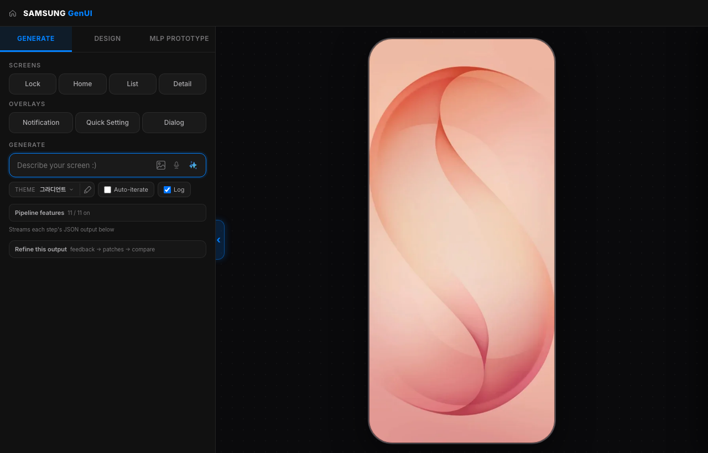
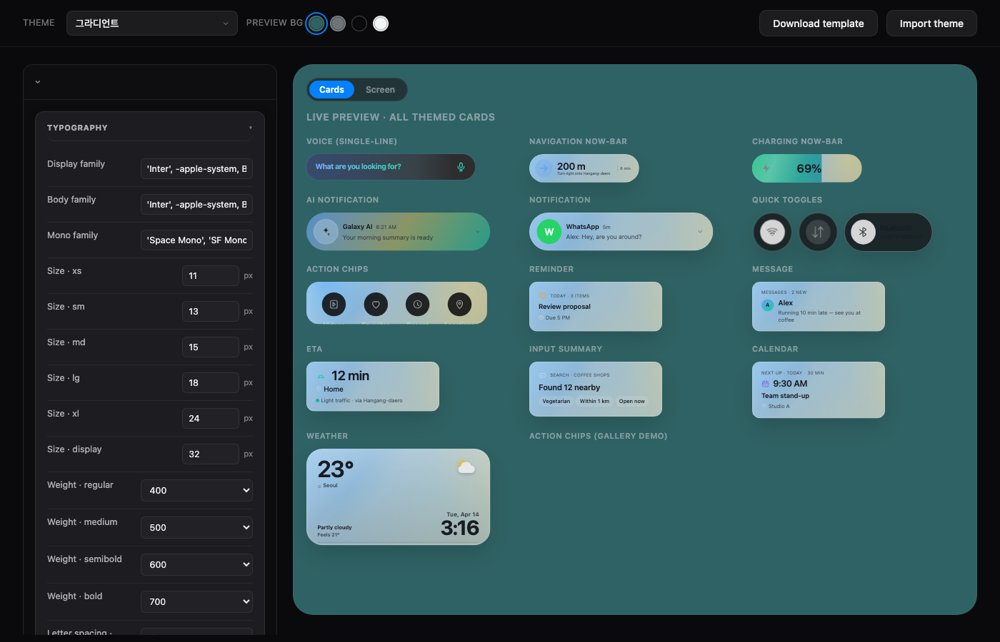
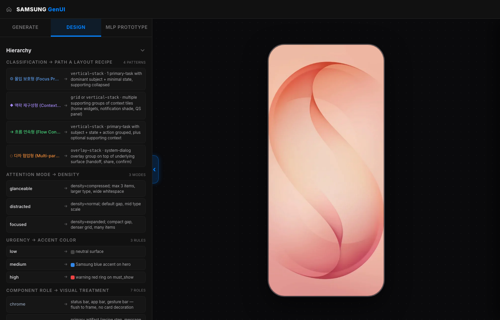
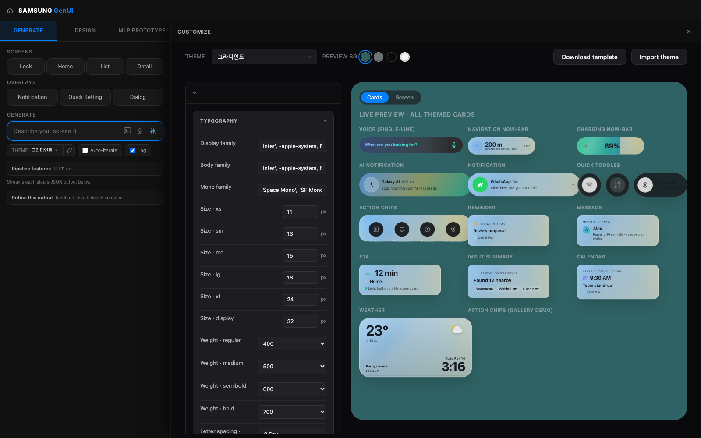
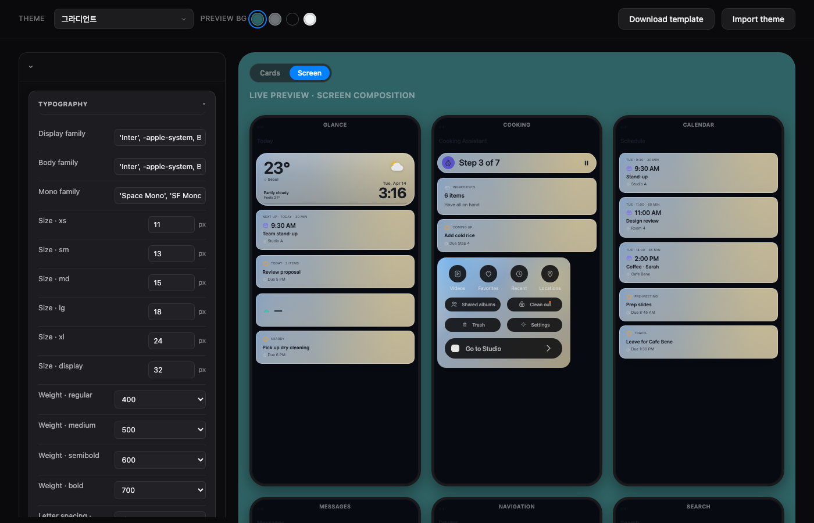
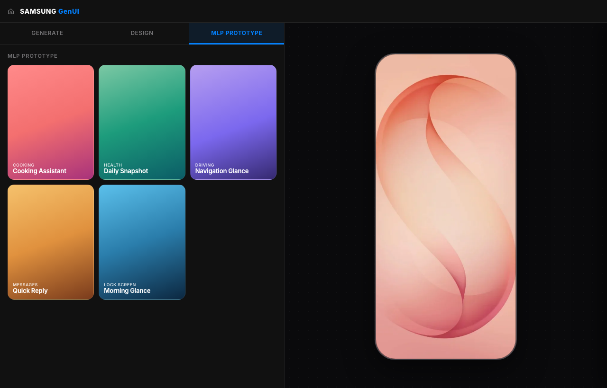

# Samsung One UI · GenUI

> 자연어 시나리오를 입력하면, One UI 8.5 기반의 모바일 UI를
> 자동 생성·검증·렌더링하는 Generative UI 파이프라인.

핵심은 **"LLM이 생성하고, 규칙 기반 후처리와 검증이 품질을 통제하는
구조"** 입니다. 단순히 AI가 화면을 "그리는" 방식이 아니라, AI 생성
결과를 디자인 시스템·컴포넌트 레지스트리·레이아웃 규칙·검증 로직으로
제어합니다.



*GenUI shell: 좌측 사이드바 (Generate / Design / MLP Prototype) ·
시나리오 입력 · 테마 픽커 + 연필(Customize 패널 트리거) ·
Auto-iterate / Log 토글 · Pipeline features · Refine · 우측 Galaxy S26
캔버스.*

---

## Framework overview

| Area | 파일 | 역할 |
|------|------|------|
| **Server** | `server.js` | HTTP · SSE pipeline · embeddings · `/api/themes` · improvement engine |
| **Pipeline** | `pipeline.js` | interpret → select (RAG) + parallel content bag → compose → validate → explain |
| **Renderer** | `app/scenes.js` · `app/surface-layout.js` · `app/templates.js` · `app/atomics.js` | orchestration → group wrapper → atomic/template render |
| **GenUI shell** | `genui.html` | 시나리오 입력 UI · canvas · theme picker · MLP gallery · pipeline feature toggles |
| **Theme editor** | `customize.html` | `:root` CSS 변수 라이브 프리뷰 + 카드/스크린 두 미리보기 모드 |
| **Knowledge** | `figma-refs/*.json` | component registry · embeddings · themes · test scenarios · rules |
| **Self-improve** | `improvement_engine.js` · `/improve` | 테스트 시나리오 기반 룰 추출 · `evolve.md` 누적 |

---

## 1. 전체 개발 파이프라인 개요

본 시스템은 사용자가 입력한 자연어 시나리오를 기반으로, 적절한 UI
구조와 콘텐츠, 레이아웃을 자동 생성하고 검증한 뒤 브라우저 화면에
렌더링하는 파이프라인입니다.

```
사용자 시나리오 입력
  → 의도 해석 및 요구사항 정리
  → UI 컴포넌트 선택
  → 콘텐츠 보강
  → 레이아웃 구성
  → 규칙 기반 검증
  → 설명 생성
  → 브라우저 렌더링 및 Export
```

개발 구조의 핵심은 두 가지입니다.

1. **LLM** 은 사용자의 자연어를 해석하고 UI 구성안을 **생성** 합니다.
2. **Deterministic rule (규칙 기반 후처리 + validator)** 가 결과를
   정리하고 오류를 줄입니다.

---

## 2. 단계별 설명

### 단계 1. 기획

**목적** — 시스템의 목적, 사용 시나리오, 화면 생성 범위, 주요 사용자
경험 방향을 정의합니다. 현재 시스템은 Galaxy S26 기준의 모바일 UI
(viewport `412×915`) 를 생성하는 구조입니다.

**주요 작업**

| 구분 | 내용 |
|------|------|
| 사용 시나리오 정의 | 어떤 상황에서 어떤 UI가 생성되어야 하는지 정의 |
| 대상 디바이스 정의 | 기본 화면 크기, 해상도, 모바일 프레임 기준 정의 |
| 생성 범위 정의 | 어떤 UI 컴포넌트와 레이아웃까지 자동 생성할지 결정 |
| 품질 기준 정의 | 일관성, 가독성, 속도, 검증 기준 설정 |
| 기능 토글 정의 | RAG, dedup, content bag, auto-grid, explain 등 기능별 on/off 구조 설정 |

**클라이언트 확인 및 결정 사항**

| 결정 항목 | 클라이언트 확인 필요 |
|----------|---------------------|
| 주요 사용 시나리오 | 어떤 사용 맥락을 우선 지원할지 |
| 대상 디바이스 | Galaxy S26 기준 유지 여부 또는 다른 viewport 추가 여부 |
| 생성 품질 기준 | 빠른 생성 우선인지, 설명 포함 full mode 우선인지 |
| UI 스타일 기준 | One UI 기반 유지 여부, 브랜드 테마 적용 범위 |
| Export 범위 | HTML Export만 필요한지, 이미지/디자인 파일 연동도 필요한지 |

**예상 산출물** — 시스템 목적 정의서 · 주요 시나리오 목록 · 기능 범위
정의서 · 초기 개발 일정표

---

### 단계 2. 요구사항 정의

**목적** — 사용자의 자연어 입력을 시스템이 처리 가능한 구조화된
데이터로 변환합니다. Stage 1+2에서 `interpretation` 과 `planningPacket`
을 동시에 생성하며, 후자는 `uiState`, `taskGroups`, `slotRequirements`,
`selectionConstraints` 를 포함합니다.

**주요 작업**

| 구분 | 내용 |
|------|------|
| 입력 데이터 정의 | `scenario_text`, `viewport`, `fastMode`, `features` 구조 |
| UI 상태 정의 | `baseSurface`, `attentionMode`, `densityMode`, `interactionMode` |
| 작업 그룹 정의 | 사용자가 달성하려는 작업을 `taskGroups` 로 구조화 |
| 슬롯 요구사항 정의 | 화면에 필요한 정보, 액션, 상태 표시 영역 정의 |
| 제약 조건 정의 | 선택 가능한 컴포넌트, 배치 규칙, 노출 우선순위 설정 |

**사용 모델 및 파일**

| 구분 | 내용 |
|------|------|
| 사용 모델 | `gpt-5.4-mini` |
| 주요 함수 | `runInterpretAndNormalize()` |
| 주요 파일 | `pipeline.js`, `schema_normalizer.js` |
| 참조 파일 | `DESIGN.md`, `GENUI-PRINCIPLES.md`, `ORCHESTRATION.md`, `design_rules.json`, `global_rules.json`, `evolve.md` |

> Stage 1+2는 기존에 분리되어 있던 해석 단계와 정규화 단계를 하나의
> LLM 호출로 통합하여 처리 시간을 줄이는 구조입니다. **평균 처리 시간
> 약 3–5초.**

**클라이언트 확인 및 결정 사항**

| 결정 항목 | 클라이언트 확인 필요 |
|----------|---------------------|
| 입력 시나리오 형식 | 자유 입력 vs 템플릿 기반 |
| `contextTags` 기준 | morning, driving 등 맥락 태그의 확장 여부 |
| `attentionMode` 기준 | glanceable, focused 등 주의 모드의 정의 |
| `densityMode` 기준 | compressed, normal 등 정보 밀도 기준 |
| 요구사항 우선순위 | 어떤 정보가 반드시 화면에 들어가야 하는지 |

**예상 산출물** — 입력 스키마 정의서 · UI 상태 정의서 ·
`interpretation` + `planningPacket` · 정규화 규칙

---

### 단계 3. 설계

**목적** — 요구사항을 바탕으로 어떤 UI 컴포넌트를 사용할지 선택하고,
각 컴포넌트에 들어갈 콘텐츠와 화면 배치 구조를 설계합니다. 크게 세
흐름으로 구성됩니다.

#### 3-1. 컴포넌트 선택

Stage 3은 RAG shortlist를 먼저 생성합니다. 사용자 시나리오를
`text-embedding-3-small` 로 임베딩한 뒤, **92개 컴포넌트 임베딩과
비교하여 top-30 후보**를 추리고, **실제 renderer가 그릴 수 있는 52개
컴포넌트** 로 필터링합니다. 이후 필수 컴포넌트를 추가해 LLM에 선택
가능한 vocabulary로 제공합니다.

| 구분 | 내용 |
|------|------|
| 사용 모델 | `gpt-5.4` |
| 주요 함수 | `runSelect()` |
| 평균 시간 | 약 9–12초 |
| 주요 산출물 | `requiredComponents[]` |
| 핵심 특징 | RAG 기반 후보 추림 · 중복 제거 · 필수 컴포넌트 주입 |

#### 3-2. 콘텐츠 보강

Stage 3.5는 UI에 들어갈 풍부한 콘텐츠 조각을 별도로 생성합니다 —
weather, calendar, reminder, message, eta, navigation, now_playing,
shortcut, input_summary, primary_subject, primary_state,
primary_action 등. **Stage 3과 병렬로 실행되므로 전체 처리 시간에 큰
영향을 주지 않습니다.**

| 구분 | 내용 |
|------|------|
| 사용 모델 | `gpt-5.4-mini` |
| 주요 함수 | `runContentBag()` |
| 평균 시간 | 약 5–7초 |
| 주요 산출물 | `contentBag` |
| 핵심 특징 | generic content를 구체적인 콘텐츠로 대체 |



*위 그림은 `contentBag` 이 채워준 콘텐츠로 렌더된 모든 카드 (Voice ·
Navigation now-bar · Charging now-bar · AI Notification · Quick Toggles ·
Action Chips · Reminder · Message · ETA · Input Summary · Calendar ·
Weather 등) 가 같은 테마 토큰을 받았을 때 어떻게 보이는지를 보여주는
customize.html의 Cards mode.*

#### 3-3. 레이아웃 구성

Stage 4는 선택된 컴포넌트를 화면 안에 어떻게 배치할지 결정합니다. LLM
이 `layoutPlan` 을 생성하고, 이후 **deterministic post-fix chain** 이
chrome migration · role reorder · auto-grid · composer backfill을
수행합니다. 즉, LLM이 작성한 레이아웃을 그대로 쓰지 않고, 규칙 기반
후처리로 정렬과 누락 보완을 수행합니다.

| 구분 | 내용 |
|------|------|
| 사용 모델 | `gpt-5.4` |
| 주요 함수 | `runComposeLayout()` |
| 평균 시간 | 약 5–8초 |
| 주요 산출물 | `layoutPlan` |
| 핵심 특징 | reference layout · closed variant set · post-fix chain 적용 |

#### 사용 파일 및 재료

| 파일 | 역할 |
|------|------|
| `component_registry.json` | 92개 컴포넌트 정의 · variants · layout_spec · allowed_contexts |
| `component_embeddings.json` | RAG 검색용 컴포넌트 임베딩 |
| `generator_memory.json` | surface별 mandatory components 및 reference layout |
| `generator.js` | rule-based ordering · positions · spacing · pre-filter |
| `pipeline.js` | 선택 · 콘텐츠 보강 · 레이아웃 구성의 주요 로직 |
| `schema_normalizer.js` | LLM 출력 정규화 |
| `DESIGN.md` | Surface taxonomy · density rules · background policy |
| `GENUI-PRINCIPLES.md` | 디자인 원칙 |
| `ORCHESTRATION.md` | chrome · frame · stacking · nesting 규칙 |
| `evolve.md` | 자기개선을 통해 누적된 제약 조건 |



*Design 탭: 위 단계에서 적용되는 디자인 규칙을 시각화한 패널.
Classification → Path A Layout Recipe (4 patterns) · Attention Mode →
Density (3 modes) · Urgency → Accent Color (3 rules) · Component Role →
Visual Treatment 등을 확인할 수 있고, Pipeline Atomic Bridge
(21 mappings, 기본 접힘) 는 클릭으로 펼쳐서 컴포넌트 ID와 atomic
렌더러의 매핑을 봅니다.*

**클라이언트 확인 및 결정 사항**

| 결정 항목 | 클라이언트 확인 필요 |
|----------|---------------------|
| 컴포넌트 범위 | 현재 92개 컴포넌트 유지 또는 확장 여부 |
| 렌더 가능 컴포넌트 | 현재 renderer가 지원하는 52개 기준 유지 여부 |
| 필수 UI 요소 | status-bar, header 등 mandatory chrome 기준 |
| 레이아웃 규칙 | grid, stack, overlay 사용 기준 |
| 콘텐츠 구체성 | 실제 데이터 연동인지, LLM 생성 콘텐츠인지 |
| 테마 적용 범위 | 기본 테마, 사용자 테마, 브랜드 테마 구분 |

**예상 산출물** — component plan · `contentBag` · `layoutPlan` · variant
reference · 디자인 규칙 문서

---

### 단계 4. 개발

**목적** — 설계된 파이프라인을 실제 서버, 클라이언트, 렌더러, 검증
시스템, 테마 시스템, Export 기능으로 구현합니다. 서버는
`/api/pipeline/full/stream` 에서 **SSE 방식** 으로 각 stage의 진행
상태를 클라이언트에 전달합니다. `step_started`, `step_done` 이벤트를
push 하고, 최종적으로 `done` 이벤트를 통해 전체 bundle을 전달합니다.

**주요 작업**

| 구분 | 내용 |
|------|------|
| 서버 개발 | API endpoint, SSE stream, 모델 호출, stage orchestration |
| 클라이언트 개발 | 입력 UI, feature toggle, progress 표시, 렌더링 처리 |
| 렌더러 개발 | `layoutPlan` 과 `plan` 을 실제 HTML/CSS 화면으로 변환 |
| 검증 시스템 개발 | plan, layout, overflow, context match 검사 |
| 테마 시스템 개발 | `themes.json`, CSS variables, customize UI |
| Export 기능 개발 | self-contained HTML export |
| 자기개선 시스템 | test scenarios 기반 개선 룰 추출 및 `evolve.md` 반영 |

#### Validation 구조

Stage 5는 **LLM 호출 없이 deterministic validator** 가 실행됩니다.

| Validator | 역할 |
|-----------|------|
| `validatePlan` | vocabulary scope · priority range · role consistency |
| `validateLayout` | unknown component · invalid variant · order mismatch |
| `validateLayoutOverflow` | viewport 초과 · glanceable child 수 초과 |
| `validateContextComponentMatch` | component와 `contextTags` 의 적합성 |

검증 결과는 `high`, `medium`, `low` severity로 분류되며, `autoFix`
가능 여부와 `reviewRequired` 여부가 함께 표시됩니다.

#### 렌더링 구조

브라우저에서는 `layoutPlan` 과 `plan` 을 기반으로 화면을 구성합니다.
크게 세 단계:

1. canvas padding과 gap 적용
2. group별 wrapper 생성
3. 각 child를 chrome atomic, body atomic, fallback template 중 하나로
   렌더링

렌더러는 `contentBySlot` → `contentByTypeQueue` → legacy `contentByType`
순서로 콘텐츠를 해결하여, 같은 `componentType` 이 여러 번 등장해도 서로
다른 콘텐츠가 표시되도록 설계되어 있습니다.

#### 사용 모델 및 파일

| 구분 | 내용 |
|------|------|
| FAST 모델 | `gpt-5.4-mini` |
| SELECT 모델 | `gpt-5.4` |
| COMPOSE 모델 | `gpt-5.4` |
| CONTENT BAG 모델 | `gpt-5.4-mini` |
| EXPLAIN 모델 | `gpt-5.4-mini` |
| Embedding 모델 | `text-embedding-3-small` |
| 주요 서버 파일 | `server.js`, `pipeline.js` |
| 주요 클라이언트 파일 | `app/scenes.js`, `app/agent.js`, `app/surface-layout.js`, `app/atomics.js`, `app/templates.js` |
| 주요 스타일 파일 | `css/genui.css` |
| 테마 파일 | `figma-refs/themes.json` |
| 테스트 파일 | `figma-refs/test_scenarios.json` |

**클라이언트 확인 및 결정 사항**

| 결정 항목 | 클라이언트 확인 필요 |
|----------|---------------------|
| 개발 우선순위 | core pipeline 먼저인지, theme/customize/export까지 포함인지 |
| 성능 기준 | full mode 20–30초 허용 여부, fastMode 15–25초 목표 여부 |
| 검증 기준 | high violation은 차단할지, warning으로 표시할지 |
| 설명 패널 | Why this UI 기능 포함 여부 |
| 자기개선 기능 | 운영 단계에 포함할지, 내부 개발 도구로만 둘지 |
| Export 방식 | HTML export 외 추가 포맷 필요 여부 |

**예상 산출물** — `/api/pipeline/full/stream` · stage별 response bundle
(`interpretation`, `planningPacket`, `plan`, `layoutPlan`, `validation`,
`explanation`, `contentBag`) · 렌더링 UI · validation report · theme
editor · export HTML · improvement dashboard

#### Theme editor — 디자이너용 토큰 라이브 프리뷰

연필 ✎ 아이콘 클릭 시 우측에서 슬라이드 인되는 **Customize 사이드
패널**. 사이드바를 제외한 캔버스 전체 폭을 차지하므로 토큰 편집
패널과 라이브 프리뷰가 동시에 보입니다. ESC · × · 연필 재클릭으로
닫힘.



*Customize 패널 (Cards mode): 좌측 Typography 토큰 편집 (Display /
Body / Mono family · 6 사이즈 · 4 weight) → 우측 모든 themed
카드들이 실시간 반영. Download template · Import theme 으로
JSON+CSS+HTML 묶음을 주고받음.*

**Cards mode vs Screen mode**



*Screen mode: 6개의 S26-비율 phone (Glance · Cooking · Calendar ·
Messages · Navigation · Search). 각 phone은 의도적으로 1-col 과 2-col
그룹을 섞어 같은 컴포넌트가 full-width hero · half-width tile 두
맥락에서 어떻게 보이는지 한 눈에 비교 가능. `--screen-padding-*`,
`--gap-screen`, `--gap-cards`, `--screen-grid-columns` 토큰의 효과를
실시간으로 검증.*

#### MLP Prototype — 시각적 데모

`MLP Prototype` 탭은 추론·검증 시스템과 분리된 **시각 쇼케이스**
영역. 손으로 큐레이션한 데모 화면 · Figma 프레임 · 비디오 링크를
타일로 모아두는 곳. 탭 활성 시 사이드바가 600px로 넓어지고 3-col
그리드로 5개 타일이 스크롤 없이 전체 노출.



*MLP Prototype: Cooking Assistant · Daily Snapshot · Navigation
Glance · Quick Reply · Morning Glance.*

---

## 3. 협업 방식

### 클라이언트와 개발팀의 역할 구분

| 단계 | 개발팀 역할 | 클라이언트 역할 |
|------|------------|---------------|
| 기획 | 시스템 범위, 구조, 개발 방식 제안 | 주요 사용 시나리오와 우선순위 결정 |
| 요구사항 정의 | 입력 구조, UI 상태, 제약 조건 설계 | 필수 기능과 제외 범위 확인 |
| 설계 | 컴포넌트 구조, 레이아웃 규칙, 검증 기준 설계 | 브랜드/디자인 기준 검토 |
| 개발 | 서버, 클라이언트, 렌더러, validator 구현 | 중간 산출물 피드백 |
| 테스트 | 대표 시나리오 기반 성능 및 품질 검증 | 실제 사용 관점의 수용 여부 판단 |
| 고도화 | 속도 최적화, 룰 개선, 컴포넌트 확장 | 추가 요구사항 및 운영 기준 결정 |

### 주요 의사결정 포인트

| # | 포인트 | 설명 |
|---|--------|------|
| 1 | **생성 범위** | 어떤 UI까지 자동 생성하고, 어떤 영역은 고정할지 |
| 2 | **컴포넌트 범위** | 92개 컴포넌트 전체를 유지할지, 우선순위 컴포넌트부터 적용할지 |
| 3 | **속도와 품질의 균형** | full mode와 fastMode 중 어떤 사용성을 우선할지 |
| 4 | **데이터 연동 수준** | 실제 서비스 데이터 연동인지, 데모용 synthetic content인지 |
| 5 | **브랜드 적용 수준** | 기본 One UI 스타일인지, 고객사 브랜드 테마까지 적용할지 |
| 6 | **검증 정책** | violation 발생 시 자동 수정 · 경고 표시 · 생성 차단 중 어떤 정책 |
| 7 | **Export 정책** | 결과물을 HTML로만 내보낼지, 디자인/개발 핸드오프 포맷까지 확장할지 |

---

## 4. 일정 흐름 예시

| 구간 | 주요 내용 | 산출물 |
|------|---------|--------|
| 1주차 | 기획 정리 및 대표 시나리오 정의 | 시나리오 목록, 기능 범위 |
| 2주차 | 요구사항 스키마 및 UI 상태 정의 | input schema, `uiState` 구조 |
| 3–4주차 | 컴포넌트 선택 및 콘텐츠 보강 파이프라인 구현 | `plan`, `contentBag` |
| 5–6주차 | 레이아웃 composer 및 renderer 구현 | `layoutPlan`, 렌더링 화면 |
| 7주차 | validation 및 post-fix chain 정교화 | validation report |
| 8주차 | 테마, Export, 설명 패널 정리 | export HTML, Why this UI |
| 9주차 이후 | 테스트 시나리오 기반 개선 및 최적화 | 개선 룰, 성능 리포트 |

현재 구조상 **전체 처리 시간은 full mode 기준 약 20–30초, fastMode
기준 약 15–25초** 입니다. 가장 큰 병목은 Stage 3의 컴포넌트 선택
단계이며, vocabulary 축소 · few-shot 축소 · Stage 3+4 병합 등을 통해
latency를 줄일 수 있습니다.

---

## 5. 리스크 및 대응 방안

| 리스크 | 설명 | 대응 방안 |
|--------|------|----------|
| LLM 출력 불안정성 | LLM이 schema와 다른 형태로 응답할 수 있음 | `schema_normalizer` 와 payload fixer로 표준화 |
| 컴포넌트 선택 오류 | 시나리오와 맞지 않는 컴포넌트가 선택될 수 있음 | RAG shortlist · `allowed_contexts` · context validation |
| 중복 콘텐츠 발생 | 같은 label이나 value가 반복될 수 있음 | **4-tier dedup ladder** + `contentBag` swap |
| 레이아웃 누락 | 선택된 컴포넌트가 `layoutPlan` 에서 빠질 수 있음 | `composerBackfill` 로 자동 보완 |
| 화면 overflow | viewport를 넘어가는 레이아웃 가능성 | `validateLayoutOverflow` 로 감지 |
| 속도 지연 | Stage 3 select가 critical path 병목 | vocabulary 축소 · cache 활용 · fastMode |
| 브랜드 일관성 부족 | 생성 UI가 브랜드 톤과 어긋날 수 있음 | theme variables · `design_rules` · component registry |
| 설명 가능성 부족 | 고객사가 왜 이런 UI가 나왔는지 이해하기 어려움 | `runExplain` 을 통해 Why this UI 패널 제공 |
| 운영 중 품질 저하 | 다양한 시나리오에서 예외 발생 가능 | `test_scenarios` + `improvement_engine` 으로 반복 개선 |

---

## 6. 최종 요약

본 시스템은 자연어 시나리오를 입력받아 모바일 UI를 자동 생성하는
GenUI 파이프라인입니다.

**핵심 파이프라인:**

1. `gpt-5.4-mini` 가 사용자 의도와 요구사항을 빠르게 해석
2. `gpt-5.4` 가 적절한 UI 컴포넌트를 선택
3. `gpt-5.4-mini` 가 콘텐츠를 보강 (Stage 2와 병렬)
4. `gpt-5.4` 가 레이아웃을 구성
5. 규칙 기반 validator가 오류 · 누락 · overflow · context mismatch 검사
6. 브라우저 렌더러가 최종 화면을 구성
7. 필요 시 explain 모델이 "왜 이런 UI가 생성되었는지" 를 설명

**파이프라인의 장점** — LLM의 생성 능력과 규칙 기반 시스템의 통제력을
**결합**. AI가 자유롭게 결과를 만들되, 컴포넌트 registry · 디자인 원칙
· 레이아웃 규칙 · validator · theme system이 결과물을 안정적으로 관리.

### 고객사가 이해해야 할 핵심 의사결정

| 의사결정 | 질문 |
|---------|------|
| **범위** | 어떤 시나리오와 화면 유형까지 자동 생성할 것인가 |
| **품질** | 속도 · 설명 가능성 · 디자인 일관성 중 무엇을 우선할 것인가 |
| **운영** | 데모형 시스템인지, 실제 서비스 연동형 시스템인지 |

현재 구조는 이미 기획·요구사항 해석·컴포넌트 선택·콘텐츠 보강·레이아웃
생성·검증·렌더링·테마·Export·자기개선까지 포함하는 **end-to-end
파이프라인** 으로 설계되어 있습니다. 고객사와의 다음 논의에서는 기술
구현 자체보다 **"어떤 사용 시나리오를 우선 제품화할 것인가"** 와
**"어떤 품질 기준을 통과해야 납품 가능한가"** 를 먼저 확정하는 것이
중요합니다.

---

## Running locally

```bash
# 1. clone
git clone https://github.com/qshim/samsung-oneui-design-system.git
cd samsung-oneui-design-system

# 2. configure (OpenAI API key)
cp .env.example .env   # or create .env with: OPENAI_API_KEY=sk-...

# 3. run
node server.js         # http://localhost:3001

# 4. open
#   /            → genui shell  (시나리오 입력 + 캔버스)
#   /customize   → theme editor (CSS 변수 라이브 프리뷰)
#   /improve     → improvement dashboard
```

요구 사항:
- Node.js 18+
- OpenAI API key (`OPENAI_API_KEY` env)
- 브라우저: Chrome / Edge / Safari 최신 (CSS `:has()` 사용)

---

## Repository layout

```
samsung-oneui-design-system/
├── server.js              # SSE pipeline · /api/themes · /api/pipeline/*
├── pipeline.js            # 5-stage LLM pipeline + post-fix chain
├── schema_normalizer.js   # LLM 출력 정규화
├── generator.js           # rule-based pre-filter + ordering
├── improvement_engine.js  # 자기개선 룰 추출
├── genui.html             # main UI shell
├── customize.html         # theme editor (cards + screen modes)
├── improve.html           # improvement dashboard
├── app/                   # client-side modules
│   ├── scenes.js          # orchestration
│   ├── surface-layout.js  # group → wrapper
│   ├── templates.js       # full-card templates
│   ├── atomics.js         # role-based atomic renderers
│   ├── agent.js           # SSE consumer
│   └── ui-panels.js       # sidebar tabs · customize side panel · MLP
├── css/genui.css          # design tokens · layout · theme bridge
├── figma-refs/
│   ├── component_registry.json   # 92 components
│   ├── component_embeddings.json # RAG embeddings
│   ├── generator_memory.json     # surface mandatories + reference layouts
│   ├── themes.json               # built-in + custom themes
│   └── test_scenarios.json       # self-improvement test suite
├── DESIGN.md              # surface taxonomy · density · background policy
├── GENUI-PRINCIPLES.md    # 디자인 원칙
├── ORCHESTRATION.md       # chrome · frame · stacking · nesting
└── evolve.md              # 누적된 자기개선 제약 조건
```

---

## Source references

- [Samsung Korea](https://www.samsung.com/sec/) · [Samsung US](https://www.samsung.com/us/)
- [Samsung Brand Identity](https://www.samsung.com/sec/about-us/brand-identity/)
- [One UI Design System](https://design.samsung.com/global/contents/one-ui/)
- [One UI Developer Docs](https://developer.samsung.com/one-ui)
- [oneui-design (GitHub)](https://github.com/OneUIProject/oneui-design)
